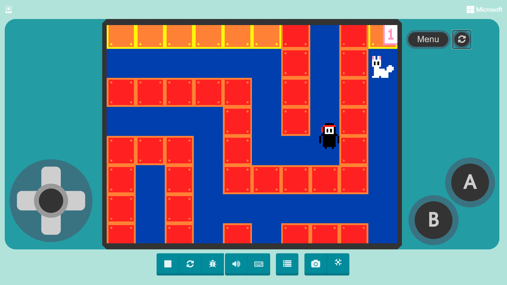
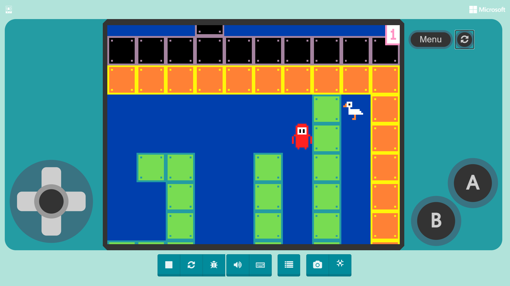
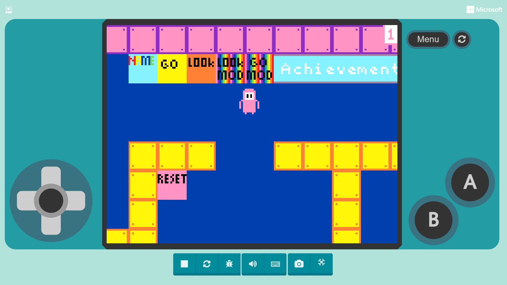
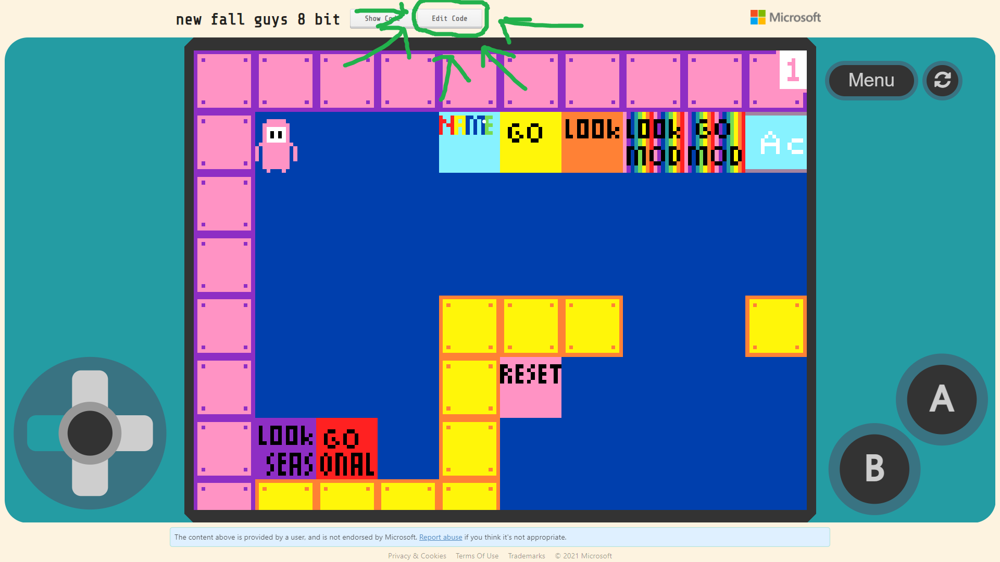
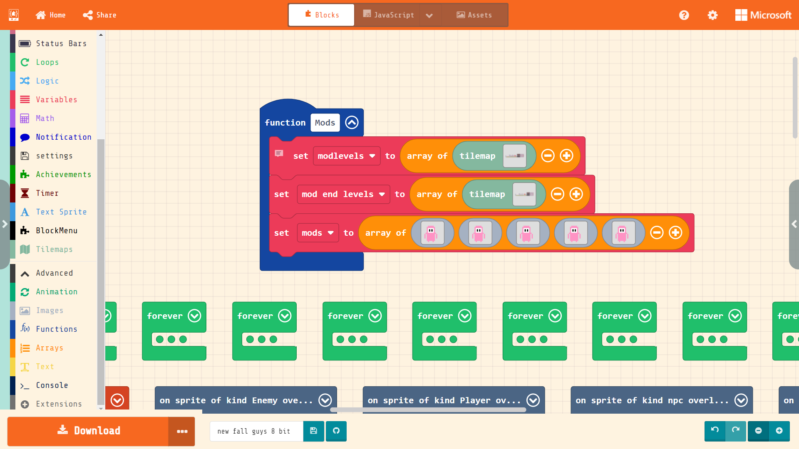

# Fall Guys 8 Bit

## How to play. 
Move up down left right with the arrow keys.
Use the Z key to jump and select stuff.
Use the X key to show names.

## Links
The Latest vershon of fall guys is 7.5
Here is the links.

[Fall Guys v7.5](https://makecode.com/_VKh6YFcu4RvR)

[Fall Guys v6.0](https://arcade.makecode.com/08827-51312-15843-525565)

[Fall Guys v5.0](https://arcade.makecode.com/03273-23829-98317-59514)

[Fall Guys v4.0](https://arcade.makecode.com/20243-71091-25554-72716)

[Fall Guys v3.0](https://arcade.makecode.com/70851-32310-43264-30415)

[Fall Guys v2.0](https://arcade.makecode.com/16614-10237-16635-71376)

[Fall Guys v1.0](https://arcade.makecode.com/09590-50304-11613-18977)

## The Easter Bunny And Other Findable Things

### The Easter Bunny 

In version 7.5 and up, you can find the Easter Bunny to unlock the Bunny world levels. 

### The Goose

The Goose is like the Easter bunny and is found like the Easter bunny. It Brings back the levels and Looks from Season 5.

## How to Make your own levels and looks
The mod look is were you can access your custom looks

To make your own looks you have to open up the ettor in makecode arcade. To do this click Edit Code.

once you click Edit Code this will bring you to the makecode project. Then you find a function named Mods. This is what it looks like.

## Seasons

### [Season 6](https://makecode.com/_VKh6YFcu4RvR)
This Season is inspired by the gold rush!! Fall Guys is now version [7.5](https://makecode.com/_VKh6YFcu4RvR).

### [Season 5](https://arcade.makecode.com/08827-51312-15843-52556)
Valentines Day, Birthday party, and Goose party all in one season. Fall guys is now version [6.0](https://arcade.makecode.com/08827-51312-15843-52556).

### [Season 4](https://arcade.makecode.com/03273-23829-98317-59514)
 
[v5.0](https://arcade.makecode.com/03273-23829-98317-59514)The winter season.

### [Season 3](https://arcade.makecode.com/20243-71091-25554-72716)  
Based off of a game I made for a game jam. The game is called Three Brave Cats. 
Here is the game, [Three Brave Cats](https://arcade.makecode.com/04978-92601-05637-89537). 

Here is theThree Brave Cats fall guys 8 bit season.
[v4.0](https://arcade.makecode.com/20243-71091-25554-72716) Has a level up bar. 

### [Season 2](https://arcade.makecode.com/70851-32310-43264-30415)

Based off of a comic I made called the Battle of New cat city.
Fall guys [v3.0](https://arcade.makecode.com/70851-32310-43264-30415) Has a couple of new taps and new levels.

### [Season 1](https://arcade.makecode.com/16614-10237-16635-71376)

[v1.0](https://arcade.makecode.com/09590-50304-11613-18977) No names. 
[v2.0](https://arcade.makecode.com/16614-10237-16635-71376) has AI names

## Mods

### TNT and Mincart mod
For fall guys 8 bit v7.5 

By: gideonmayhew
 
controllable minecart mod and tnt big explosion mod 

Here is the 
[TNT and Mincart mod](https://makecode.com/_HejR8uY8H46u)

### Slime mod
For fall guys 8 bit v7.5 

By: lucasmayhew
 
Here is the 
[Slime Mod](https://makecode.com/_93c8T23U4fpX)
